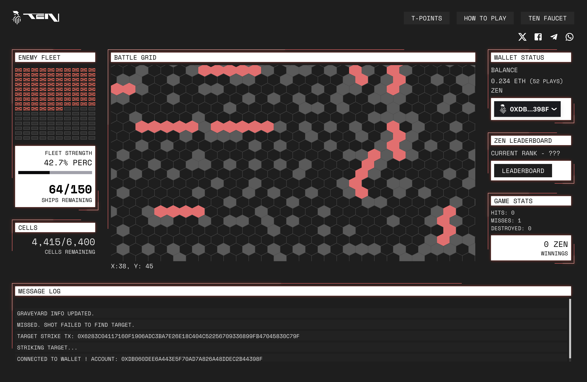

# Battleship Game
On-chain game heavily inspired by the classic board game Battleships. Players are presented with a grid and select squares to try to sink as many of the ships as possible.
Each successful hit or ship sinking is rewarded with a ZEN game token.



## Local environment setup

### Set environment variables

Create an .env file in the root of the application directory

```shell
touch .env.development
```


Add the following env vars....

```
USER_KEY=<KEY>
PRIVATE_KEY=<KEY>
VITE_CONTRACT_ADDRESS=<CONTRACT ADDRESS>
VITE_ZEN_CONTRACT_ADDRESS=<ZEN CONTRACT ADDRESS>
VITE_ZEN_API=https://faucet.ten.xyz

```
-   Replace `plugin:@typescript-eslint/recommended` to `plugin:@typescript-eslint/recommended-type-checked` or `plugin:@typescript-eslint/strict-type-checked`
-   Optionally add `plugin:@typescript-eslint/stylistic-type-checked`
-   Install [eslint-plugin-react](https://github.com/jsx-eslint/eslint-plugin-react) and add `plugin:react/recommended` & `plugin:react/jsx-runtime` to the `extends` list

## Deploying Battleships

The test version of the contract requires to deploy ZEN first and push it's address to the constructor of `BattleshipGameTestnet`. Then it's crucial to call `mint()` function on ZEN contract specifying `BattleshipGameTestnet` as a receiver. The target amount to mint is `1262 * 10**18` (`1262000000000000000000`).

### Install dependencies

`npm ci`

### Run dev environment

`npm run dev`
